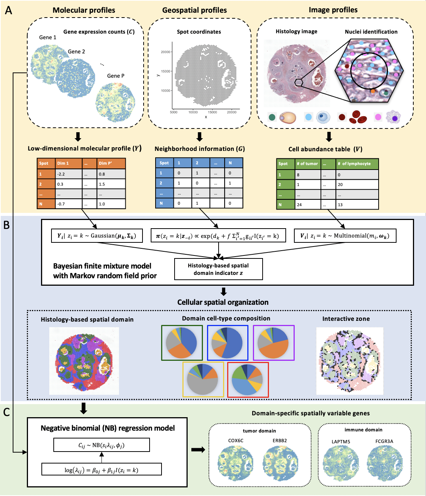

# iIMPACT

## Overview
iIMPACT is a novel method which integrates image and molecular profiles for spatial transcriptomics analysis. It is a multi-stage statistical method for spatial domain identification and domain-specific spatially variable gene detection. It utilizes an interpretable Bayesian finite mixture model for analyzing the cellular spatial organization and a regression model for domain-specific spatially variable gene analysis. Compared with existing methods for spatial transcriptomics data analysis, iIMPACT fully leverages the biological features from histology image, which causes compromised algorithm accuracy and the interpretability of histological characterization of single cells on domain level. iIMPACT provides a highly accurate and interpretable clustering approach to reveal cellular spatial organization and functional gene landscape from spatial transcriptomics data.   

With iIMPACT, you can:

- Identify spatial domains using a Bayesian finite mixture model with Markov random field.
- Charactize spatial domains based on posterior inference, including domain-level cell-type proportion estimation and interactive zone detection.
- Detect domain-specific spatially variable genes for specific domains via a negative binomial regression model.

## Tutorial
For the step-by-step tutorial, please refer to:

