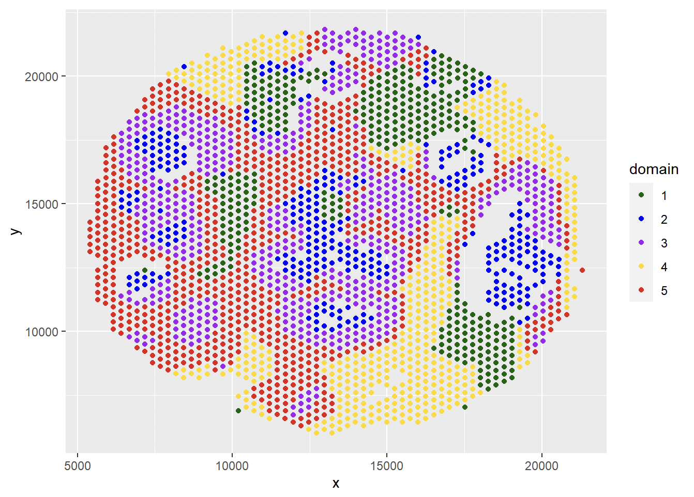
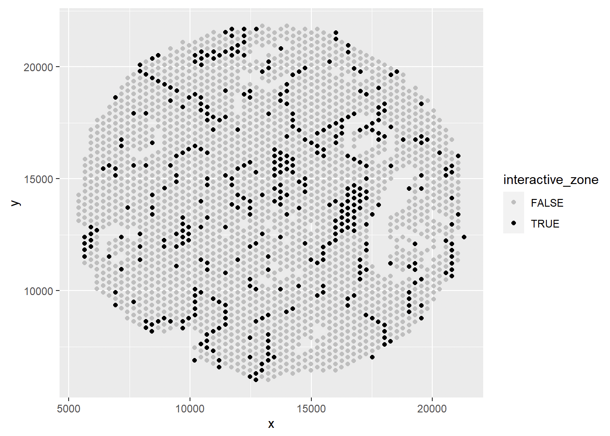
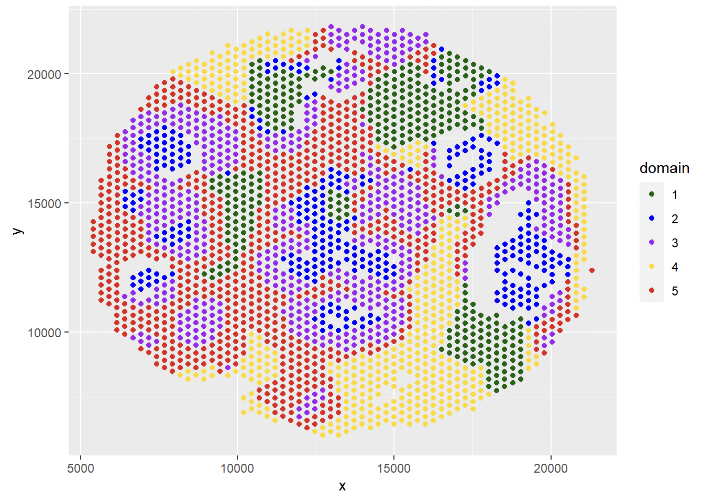

Example - Human Breast Cancer 10x Visium Data
===============================

In the following, we choose the human breast cancer FFPE data from 10x Visium platform to show the spatial domain identification process on these sequencing-based SRT data. 

Load Data
------------------------------------------

The current version of iIMPACT requires three input data: 

* The gene expression count matrix 'count': :raw-latex:`\(n\times p\)` (:math:`n` - number of spots; :math:`p` - number of genes)
* The location information matrix 'loc': :raw-latex:`\(n\times 2\)`. It includes the x and y coordinate for each sample point.
* The nuclei identification information matrix 'cell_info': :raw-latex:`\(m\times 3\)`. It includes the x and y coordinate and the nuclei class for identified cells.

The first two data should be stored in R matrix format. For gene expression count matrix, column names should be gene names. 

In the following, we conduct the analysis on 10x Visium human breast cancer FFPE data and  as two examples to show the functions for the implementation of iIMPACT. 

Files can be downloaded from 'data' folder on the Dropbox: 
https://www.dropbox.com/scl/fo/em51owbpda4id0rnnin1x/h?dl=0&rlkey=nk9kc38ghs9wdjpqno7k3e1qp
::
    # read data
    cell_info <- read.csv('data/human breast cancer FFPE data/10x_breast_cancer_ffpe_cell_info.csv')
    spot_loc <- read.csv('data/human breast cancer FFPE data/10x_human_breast_cancer_ffpe_loc.csv', row.names = 1)

    count <- read.csv('data/human breast cancer FFPE data/10x_human_breast_cancer_ffpe_count.csv', row.names = 1)

    print(dim(count))
    ## [1]  2518 17943
    
    print(dim(spot_loc))
    ## [1] 2518    2

    print(dim(cell_info))
    ## [1] 156235      4

This human breast cancer FFPE data has 2,518 sample points and 17,943 genes. For the pathology image, the HD staining model identified 156,235 nuclei.

Process Data
------------------------------------

Before run iIMPACT for spatial domain identification, there are several steps to prepare the data. 

Generate cell abundance data
~~~~~~~~~~~~~~~~~~~~~~~~~~~~~~~~~~~~

We process the nuclei segmentation results from the HD staining model to the cell abundance data :math:`V` by counting the cells with different types in each expanded area. 
::
    cell_loc <- cell_info[, c('x', 'y')]
    cell_type <- cell_info$nucleus_class
    V <- get_cell_abundance(cell_loc, cell_type, spot_loc, lattice = 'hexagon')
    ## [1] "0% has been done"
    ## [1] "10% has been done"
    ## [1] "20% has been done"
    ## [1] "30% has been done"
    ## [1] "40% has been done"
    ## [1] "50% has been done"
    ## [1] "60% has been done"
    ## [1] "70% has been done"
    ## [1] "80% has been done"
    ## [1] "90% has been done"
    ## [1] "100% has been done"

    print(dim(V))
    ## [1] 2518    7

    print(head(V))
    ##      stroma necrosis lymphocyte blood tumor ductal epithelium macrophage
    ## [1,]    105        7         28    38     9                 3          2
    ## [2,]     60        0         37    39     0                 0          0
    ## [3,]     81        6         38    20     1                 0          0
    ## [4,]     73        2         21    15     0                 0          0
    ## [5,]     63        1         63    19     0                 0          0
    ## [6,]     86        1         70    19     0                 0          0

For the pathology image, the model identified 156,235 nuclei with 7 cell types. 

The obtained cell abundance data :math:`V` has dimension :raw-latex:`\(2518\times 7\)` (:raw-latex:`\(n\times q\)` matrix, :math:`q` is the number of cell types).

Generate low-dimensional representation of molecular profiles
~~~~~~~~~~~~~~~~~~~~~~~~~~~~~~~~~~~~~~~~~~~~~~~~~~~~~~~~~~~~~~~~~~

Before fitting the finite mixture model, the raw gene expression counts were normalized and transformed to the logarithmic scale. We selected the normalized expression levels of top 2,000 highly variable genes and did the dimensionality reduction to reduce the dimension using principal component analysis (PCA). Here we set the reduced dimension to be 3. 
::
    Y <- process_gene_expression(count, n_PC = 3)

    print(dim(Y))
    ## [1] 2518    3

    print(head(Y))
    ##          PC1       PC2        PC3
    ## 1 -24.172837 -4.584487  5.5806516
    ## 2  12.371814 -7.119854 -1.1115033
    ## 3  -3.332869  8.108653  0.7678203
    ## 4  18.560136 -5.305400  6.4929754
    ## 5  19.731972  4.777125  3.9005968
    ## 6  15.068430  3.544484 -5.7039848

Generate neighborhood information
~~~~~~~~~~~~~~~~~~~~~~~~~~~~~~~~~~~~~~~~~~~~~

Instead of coordinates, iIMPACT method requires the neighbor information of spots. We apply get.neighbor function to generate the neighbor information. Sample points for this data are located on a hexagon lattice, so each spots has 6 neighbors. 
::
    G <- get.neighbor(spot_loc, 6)

Spatial Domain Identification
--------------------------------------

Run finite mixture model
~~~~~~~~~~~~~~~~~~~~~~~~~~~~~~~~~~~~~~~

'run_iIMPACT' function requires the cell abundance data from image profile :math:`V`, molecular profile :math:`Y` and neighborhood information :math:`G` as input.  We also need to set two parameters: the number of domains (clusters) 'n_cluster', and the scaling parameter to control the contribution of image profile 'w'. 

After fitting the finite mixture model, a label switching step is necessary. We can specify a cell-type as the reference of label switching and pass the corresponding column index in :math:`V` to the function via the 'label_switch_refer' parameter. The default index is 1.
::
    # set number of clusters
    K <- 5

    # set the scaling parameter for image profile
    w <- 1/20

    # run iIMPACT
    result <- run_iIMPACT(V, Y, G, n_cluster = K, w)
    ## 10% has been done
    ## 20% has been done
    ## 30% has been done
    ## 40% has been done
    ## 50% has been done
    ## 60% has been done
    ## 70% has been done
    ## 80% has been done
    ## 90% has been done
    ## [1] "100% has been done"

Characterize identified spatial domains
~~~~~~~~~~~~~~~~~~~~~~~~~~~~~~~~~~~~~~~~~~~~~~

After obtaining the posterior samples of Bayesian mixture model via the 'run_iIMPACT' function, we can obtain the spatial domain identification results via the 'get_spatial_domain' function.
::
    spatial_domain <- get_spatial_domain(result)

    # plot results
    df <- data.frame(x = spot_loc$x, y = spot_loc$y, domain = as.factor(spatial_domain))
    ggplot(df, aes(x = x, y = y, color = domain)) +           
      geom_point() + scale_color_manual(values=c('1' = "#006400", '2' = "#0000ff", '3' = "#A020F0", '4' = '#ffd800', '5' = '#e41a1a' ))

Get domain-level cell proportion: each row is the cell-type proportion for the corresponding domain (cluster)
::
    domain_cell_prop <- get_domian_cell_prop(result)

    print(domain_cell_prop)
    ##         stroma    necrosis lymphocyte      blood       tumor ductal epithelium
    ## [1,] 0.2407925 0.009875297 0.19702032 0.53671201 0.007796473       0.002970890
    ## [2,] 0.3798334 0.040353830 0.06321755 0.30010776 0.194550348       0.017041318
    ## [3,] 0.4022183 0.043747324 0.04294920 0.08177120 0.367408090       0.060929387
    ## [4,] 0.5122341 0.020637669 0.25527049 0.20140560 0.007971780       0.002090986
    ## [5,] 0.5443293 0.017708266 0.30624709 0.08886796 0.034487317       0.007642422
    ##        macrophage
    ## [1,] 0.0048135037
    ## [2,] 0.0046354940
    ## [3,] 0.0009506316
    ## [4,] 0.0001363861
    ## [5,] 0.0007175787

Get interactive zones: spots with high uncertainty on domain assignment.
::
    interactive_zone <- get_interactive_zone(result)

    df <- data.frame(x = spot_loc$x, y = spot_loc$y, interactive_zone = interactive_zone)
    ggplot(df, aes(x = x, y = y, color = as.factor(interactive_zone))) +           
      geom_point() + scale_color_manual(values=c('TRUE' = "black", 'FALSE' = "grey"))

Refine spatial domain results
~~~~~~~~~~~~~~~~~~~~~~~~~~~~~~~~~~~~~~~~

iIMPACT provides an optional refinement step for the spatial domain identification results. In this step, we need to define a parameter 'area_unit' as an unit of small area. For an area with the number of spots is less or equal to the 'area_unit', if all neighbors of this area belong to a same cluster, the clustering result of this small area will be relabeled to the same domain of its neighboring area. 
::
    spatial_domain_new <- cluster_refine(G, spatial_domain, area_unit = 3)

    # plot results
    df <- data.frame(x = spot_loc$x, y = spot_loc$y, domain = spatial_domain_new)
    ggplot(df, aes(x = x, y = y, color = as.factor(domain))) +           
      geom_point() + scale_color_manual(values=c('1' = "#006400", '2' = "#0000ff", '3' = "#A020F0", '4' = '#ffd800', '5' = '#e41a1a' ))
      

