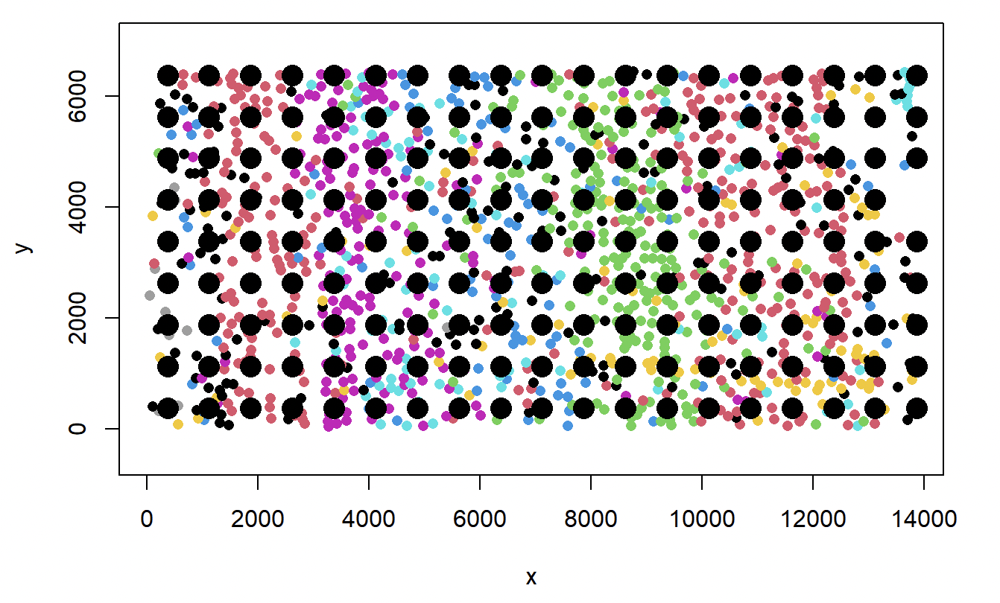
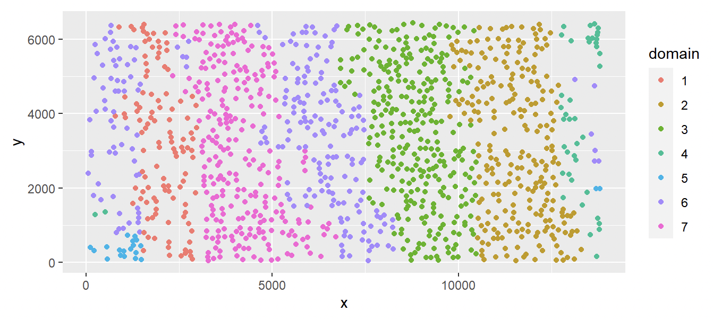

Example - Mouse Visual Cortex STARmap Data
==========================

This dataset was generated from an imaging-based spatial molecular profiling technology platform with a resolution of single-cell level. 

Load Data
----------------------------

For data generated from imaging-based techniques, the current version of iIMPACT requires two input data: 

* The gene expression count matrix 'count': :math:`m` by :math:`p` (:math:`m` - number of cells; :math:`p` - number of genes)
* The location and cell type information matrix 'cell_info': :math:`m` by :math:`3`. It includes the x and y coordinate, and the cell type for each cell.

These two data should be stored in R matrix format. For gene expression count matrix, column names should be gene names. 

Data can be downloaded from 'data' folder on the Dropbox: 
https://www.dropbox.com/scl/fo/em51owbpda4id0rnnin1x/h?dl=0&rlkey=nk9kc38ghs9wdjpqno7k3e1qp
::
        # read data
        starmap_data <- read.csv('data/mouse visual cortex STARmap data/mouse_visual_cortex_STARmap.csv')

        # get count and cell_info
        count <- starmap_data[, -(1:5)]
        cell_info <- starmap_data[, c('x_pixel', 'y_pixel', 'cell_type')]
        colnames(cell_info)[1:2] <- c('x', 'y')

        print(dim(count))
        ## [1] 1207 1020

        print(dim(cell_info))
        ## [1] 1207    3

This mouse visual cortex STARmap data has dimension 1,207 cells and 1,020 genes.

Process Data
-------------------------------

Before run iIMPACT for spatial domain identification, there are several steps to prepare the data. iIMPACT conduct clustering on spot level, so we need to create a grid lattice and assign each cell to the corresponding spot.

Create grid
~~~~~~~~~~~~~~~~~~~~~~~~~~~~~~~~~

The first step to handle the imaging-based SRT data is to manually add grids with appropriate size on the whole tissue region.
::
        grid_spot <- create.grid(cell_info, size = 750)

        spot_loc <- grid_spot[['spot_loc']]
        cell_assignment <- grid_spot[['cell_assignment']]

        # plot cell and assigned square lattice
        plot(cell_info$y, cell_info$x, col = as.factor(cell_info$cell_type), pch = 16, asp = 1, xlab = 'y', ylab = 'x')
        points(spot_loc[, 'y'], spot_loc[ ,'x'], cex = 2, pch = 16)

Generate cell abundance, low-dimensional representation of molecular profiles, and neighborhood information
~~~~~~~~~~~~~~~~~~~~~~~~~~~~~~~~~~~~~~~~~~~~~~~~~~~~~~~~~~~~~~~~~~~~~~~~~~~~~~~~~~~~~~~~~~~~~~~~~~~~~~~~~~~~~~~~
After creating grids, we obtain cell abundance data :math:`V` as the counts of cells with different types in each square area. For single-cell level molecular profiles, we normalized, transformed, and reduced the dimension of the gene expression counts following the same steps for data from sequencing-based techniques. Low-dimensional gene expression profiles :math:`Y` were then transformed to the spot level by averaging across all cells in each spot. 
::
        # Generate cell abundance and low-dimensional representation of molecular profiles
        data_for_iIMPACT <- process.imaging.based.SRT(count, cell_info, cell_assignment, n_PC = 3)

        Y <- data_for_iIMPACT[['Y']]
        V <- data_for_iIMPACT[['V']]

        # generate neighborhood information
        G <- get.neighbor(spot_loc, 4)

Spatial Domain Identification
----------------------------------

Run finite mixture model
~~~~~~~~~~~~~~~~~~~~~~~~~~~~~~~~~

'iIMPACT.ru ' function requires the cell abundance data from image profile :math:`V`, molecular profile :math:`Y` and neighborhood information :math:`G` as input. We also need to set two parameters: the number of domains (clusters) ‘n_cluster’, and the scaling parameter to control the contribution of image profile ‘w’ (set as 0.5). After fitting the finite mixture model, a label switching step is necessary. 
::
        # set number of clusters
        K <- 7

        # set the scaling parameter for image profile
        w <- 1/2

        # run iIMPACT
        result <- iIMPACT.run(V, Y, G, n_cluster = K, w)
        ## 10% has been done
        ## 20% has been done
        ## 30% has been done
        ## 40% has been done
        ## 50% has been done
        ## 60% has been done
        ## 70% has been done
        ## 80% has been done
        ## 90% has been done
        ## [1] "100% has been done"

Characterize identified spatial domains
~~~~~~~~~~~~~~~~~~~~~~~~~~~~~~~~~~~~~~~~~~~~~

After obtaining the posterior samples of Bayesian mixture model via the 'iIMPACT.run' function, we can obtain the spatial domain identification results via the 'get.spatial.domain' function. Note that this clustering result is at spot level. To project the results back to single cell level, we need to use the 'get.cell.spatial.domain' function.
::
        spatial_domain <- get.spatial.domain(result)
        spatial_domain_cell <- get.cell.spatial.domain(spatial_domain, cell_assignment)

        # plot results at single cell level
        df <- data.frame(x = cell_info$y, y = cell_info$x, domain = as.factor(spatial_domain_cell))
        ggplot(df, aes(x = x, y = y, color = domain)) +           
          geom_point()

